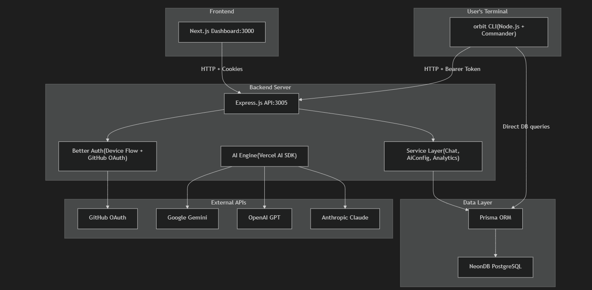
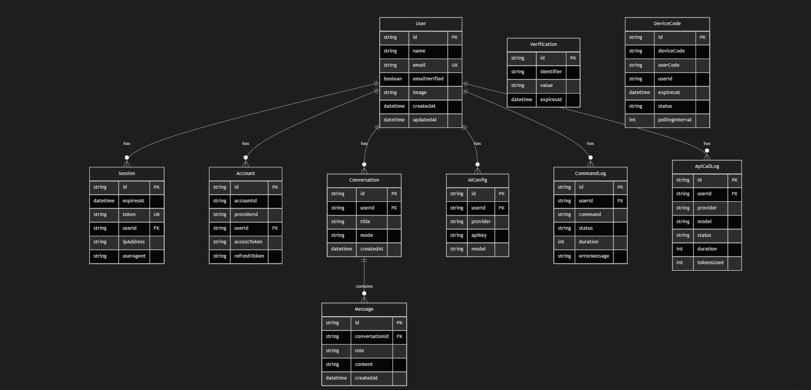
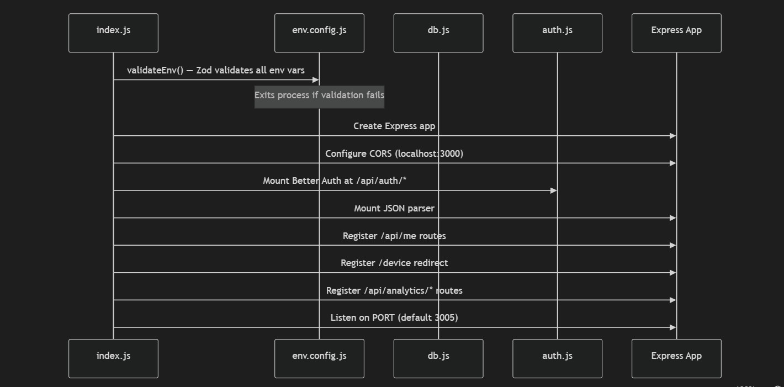
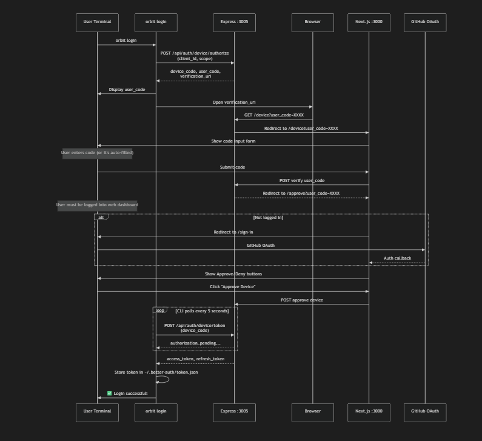
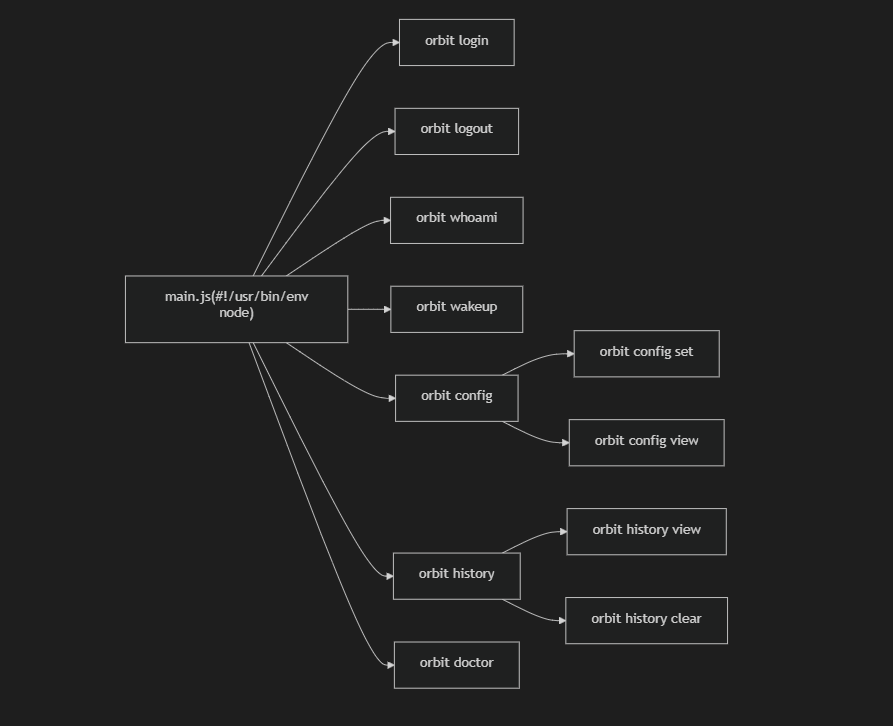
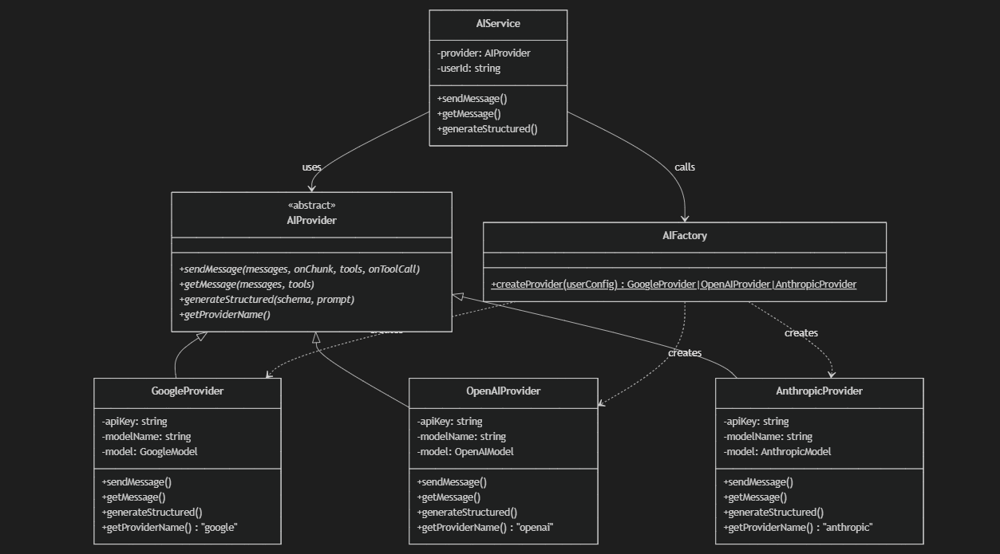
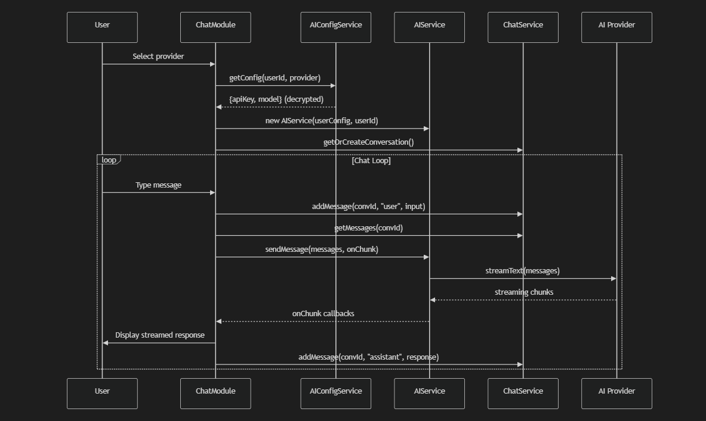

# 🛰️ Orbit-CLI — Complete Codebase Deep-Dive

> **Purpose:** This document covers _every_ layer of the Orbit-CLI project so you can confidently explain the architecture, design decisions, and implementation details in any interview or conversation.

---

## 1. What Is Orbit-CLI?

Orbit-CLI is a **full-stack, AI-powered command-line agent** that lets users chat with multiple AI providers (Google Gemini, OpenAI GPT, Anthropic Claude) directly from the terminal. It ships with:

| Capability          | Details                                                                                                 |
| ------------------- | ------------------------------------------------------------------------------------------------------- |
| **Multi-model AI**  | Google Gemini, OpenAI GPT, Anthropic Claude — user picks at runtime                                     |
| **3 Chat Modes**    | Plain Chat, Tool Calling (Google Search, Code Execution, URL Context), Agent Mode (full app generation) |
| **Secure Auth**     | Device Flow OAuth via Better Auth + GitHub Social Login                                                 |
| **Per-user Config** | Users store their own API keys (AES-256-GCM encrypted at rest)                                          |
| **Analytics**       | Command & API call tracking with a visual dashboard                                                     |
| **Web Dashboard**   | Next.js 16 frontend for login, device authorization, profile & analytics                                |

---

## 2. High-Level Architecture



> [!IMPORTANT]
> The CLI talks to the Express backend for **authentication** but also connects **directly to Prisma** for chat, config, and analytics operations. This is a key architectural decision — the CLI and server share the same database access layer because they live in the same `server/` package.

---

## 3. Monorepo Structure

```
orbit-cli-dev/
├── client/                    # Next.js 16 frontend (React 19, Tailwind v4)
│   ├── app/                   # App Router pages
│   │   ├── (auth)/sign-in/    # GitHub OAuth sign-in page
│   │   ├── analytics/         # Analytics dashboard (Recharts)
│   │   ├── approve/           # Device approval page
│   │   ├── device/            # Device code entry page
│   │   ├── layout.tsx         # Root layout (Poppins font, ThemeProvider)
│   │   ├── page.tsx           # Home — user profile + session status
│   │   └── globals.css        # Global styles
│   ├── components/            # Shared React components
│   │   ├── approve-content.tsx  # Device approval logic
│   │   ├── login-form.tsx       # GitHub social login form
│   │   ├── theme-provider.tsx   # next-themes wrapper
│   │   └── ui/                  # shadcn/ui component library
│   ├── hooks/                 # Custom React hooks
│   │   └── use-mobile.ts       # Mobile viewport detection
│   └── lib/                   # Client utilities
│       ├── auth-client.ts       # Better Auth React client
│       └── utils.ts             # cn() class merger
│
├── server/                    # Express.js backend + CLI (ES Modules)
│   ├── src/
│   │   ├── index.js             # Express server entry point
│   │   ├── cli/                 # CLI subsystem
│   │   │   ├── main.js            # Commander program entry (#!/usr/bin/env node)
│   │   │   ├── commands/          # All CLI commands
│   │   │   │   ├── auth/login.js    # login, logout, whoami
│   │   │   │   ├── ai/wakeUp.js     # wakeup command (mode selector)
│   │   │   │   ├── config/config.js # config set, config view
│   │   │   │   ├── history/history.js # history view, history clear
│   │   │   │   └── system/doctor.js   # orbit doctor (diagnostics)
│   │   │   ├── chat/              # Chat mode implementations
│   │   │   │   ├── chat-with-ai.js       # Plain chat mode
│   │   │   │   ├── chat-with-ai-tool.js  # Tool calling mode
│   │   │   │   ├── chat-with-ai-agent.js # Agent (app generator) mode
│   │   │   │   └── chat-with-ai-old.js   # Legacy/deprecated chat
│   │   │   ├── ai/               # CLI-side AI abstraction
│   │   │   │   └── ai-service.js   # AIService (facade over providers)
│   │   │   └── utils/            # CLI utilities
│   │   │       ├── history.js       # HistoryManager (file-based persistence)
│   │   │       └── input-with-history.js # readline with arrow-key history
│   │   ├── config/              # Configuration modules
│   │   │   ├── env.config.js      # Zod-validated environment variables
│   │   │   ├── agent.config.js    # Agent mode: structured output + file generation
│   │   │   ├── tool.config.js     # Google tool definitions (search, code, URL)
│   │   │   ├── google.config.js   # Google API key + model defaults
│   │   │   ├── openai.config.js   # OpenAI API key + model defaults
│   │   │   └── anthropic.config.js # Anthropic API key + model defaults
│   │   ├── services/            # Business logic layer
│   │   │   ├── chat.services.js     # Conversation + message CRUD
│   │   │   ├── aiConfig.services.js # Per-user AI config (encrypted API keys)
│   │   │   ├── analytics.services.js # Command & API call logging + stats
│   │   │   └── ai/                 # AI provider abstractions
│   │   │       ├── ai.provider.js     # Abstract base class (interface)
│   │   │       ├── ai.factory.js      # Factory pattern — creates providers
│   │   │       └── providers/         # Concrete provider implementations
│   │   │           ├── google.provider.js
│   │   │           ├── openai.provider.js
│   │   │           └── anthropic.provider.js
│   │   └── lib/                 # Shared utilities
│   │       ├── auth.js            # Better Auth server config
│   │       ├── auth-client.js     # Better Auth client for CLI polling
│   │       ├── db.js              # Prisma client singleton
│   │       ├── encryption.js      # AES-256-GCM encrypt/decrypt for API keys
│   │       ├── analytics.js       # trackCommand() and trackApiCall() wrappers
│   │       └── withAnalytics.js   # Higher-order function for auto-tracking
│   ├── prisma/
│   │   ├── schema.prisma        # 9 database models
│   │   └── migrations/         # Prisma migration history
│   ├── scripts/
│   │   ├── check-env.js         # Standalone env checker
│   │   └── seed-analytics.js    # Seed analytics data for testing
│   └── tests/
│       ├── env.config.simple.test.js  # Simple env validation tests
│       └── env.config.test.js         # Full env validation tests
│
├── .github/                   # GitHub templates
│   ├── ISSUE_TEMPLATE/
│   └── PULL_REQUEST_TEMPLATE.md
├── screenshot/                # Project screenshots
├── Readme.md                  # Main project documentation
├── CONTRIBUTION.md            # Contribution guidelines
└── LICENSE                    # MIT License
```

---

## 4. Database Schema (Prisma)

📄 [schema.prisma](file:///c:/Users/r7685/OneDrive/Desktop/git/orbit-cli-dev/server/prisma/schema.prisma)

The project uses **9 Prisma models** on PostgreSQL (NeonDB):



### Key Design Decisions:

| Model                                                      | Purpose                       | Notable                                                                                                 |
| ---------------------------------------------------------- | ----------------------------- | ------------------------------------------------------------------------------------------------------- |
| `User`, `Session`, `Account`, `Verification`, `DeviceCode` | Managed by Better Auth        | Better Auth auto-manages these via its Prisma adapter                                                   |
| `Conversation` + `Message`                                 | Chat persistence              | `mode` field tracks chat/tool/agent; Messages store role + content                                      |
| `AiConfig`                                                 | Per-user AI provider settings | `@@unique([userId, provider])` — one config per provider per user; API key is **AES-256-GCM encrypted** |
| `CommandLog` + `ApiCallLog`                                | Analytics/observability       | Tracks every CLI command and AI API call with duration, status, error details                           |

---

## 5. Backend Server — Express.js

📄 **index.js**

The Express server (`:3005`) is surprisingly lean — it primarily serves as an **authentication gateway** and **analytics API**:

### Route Map

| Route                             | Method | Auth   | Purpose                                            |
| --------------------------------- | ------ | ------ | -------------------------------------------------- |
| `/api/auth/*splat`                | ALL    | —      | Better Auth handler (login, sessions, device flow) |
| `/api/me`                         | GET    | Cookie | Get session from cookies (for web dashboard)       |
| `/api/me/:access_token`           | GET    | Bearer | Get session from token (for CLI)                   |
| `/device`                         | GET    | —      | Redirect to Next.js device page with user_code     |
| `/api/analytics/commands`         | GET    | Cookie | Command usage stats                                |
| `/api/analytics/api-calls`        | GET    | Cookie | API call stats                                     |
| `/api/analytics/command-timeline` | GET    | Cookie | Recent command logs                                |
| `/api/analytics/api-timeline`     | GET    | Cookie | Recent API call logs                               |

### Startup Flow



### Environment Validation

📄 **env.config.js**

Uses **Zod schemas** for strict validation at startup:

```javascript
const envSchema = z.object({
  PORT: z.string().regex(/^\d+$/).default("3005"),
  DATABASE_URL: z.string().url(),
  BETTER_AUTH_SECRET: z.string().min(32),
  BETTER_AUTH_URL: z.string().url(),
  GITHUB_CLIENT_ID: z.string().min(1),
  GITHUB_CLIENT_SECRET: z.string().min(1),
  AI_CONFIG_ENCRYPTION_SECRET: z.string().min(32).optional(),
  GOOGLE_GENERATIVE_AI_API_KEY: z.string().optional(),
  ORBITAI_MODEL: z.string().default("gemini-2.5-flash"),
  NODE_ENV: z
    .enum(["development", "production", "test"])
    .default("development"),
});
```

> [!TIP]
> **Interview point:** The env validation exits the process immediately with friendly error messages if any required variable is missing — this is a production best practice called **fail-fast configuration**.

---

## 6. Authentication System

### 6.1 Better Auth Configuration

📄 **auth.js**

The project uses [Better Auth](https://www.better-auth.com/) with two key plugins:

1. **Device Authorization Flow** — RFC 8628 compliant. Enables CLI → browser → approve flow.
2. **GitHub Social Provider** — Users sign in with their GitHub account.

```javascript
export const auth = betterAuth({
  database: prismaAdapter(prisma, { provider: "postgresql" }),
  plugins: [deviceAuthorization({ expiresIn: "30m", interval: "5s" })],
  socialProviders: {
    github: {
      clientId: process.env.GITHUB_CLIENT_ID,
      clientSecret: process.env.GITHUB_CLIENT_SECRET,
    },
  },
});
```

### 6.2 Device Flow Authentication (CLI → Browser → Approve)

This is the most interesting auth pattern in the project. Here's the complete flow:



### 6.3 Token Storage

📄 **login.js**

Tokens are stored as JSON in `~/.better-auth/token.json`:

```json
{
  "access_token": "...",
  "refresh_token": "...",
  "token_type": "Bearer",
  "scope": "openid profile email",
  "expires_at": "2026-06-13T...",
  "created_at": "2026-06-12T..."
}
```

Key functions exported from **login.js**:

- `getStoredToken()` — Reads token from disk
- `storeToken(token)` — Saves token to disk
- `clearStoredToken()` — Deletes token file
- `isTokenExpired()` — Checks if < 5 minutes until expiry
- `requireAuth()` — Gate function that exits if unauthenticated

---

## 7. CLI Subsystem

### 7.1 CLI Entry Point

📄 **main.js**

The CLI binary is registered in `package.json` as `"orbit": "src/cli/main.js"`. When you run `npm link`, the `orbit` command becomes globally available.



Notable: `validateEnv()` is **skipped** for `orbit doctor` — the doctor command is designed to diagnose env issues, so it can't require valid env to run.

### 7.2 Command Details

#### `orbit login` — Device Flow Authentication

📄 **login.js**

- Creates a Better Auth client with `deviceAuthorizationClient()` plugin
- Requests a device code from the server
- Opens the user's browser to the verification URL
- Polls the server every 5 seconds until the user approves
- Handles `slow_down`, `expired_token`, and `access_denied` errors gracefully
- Saves the token to `~/.better-auth/token.json`

#### `orbit logout` — Clear Session

📄 **login.js**

- Confirms with user before logging out
- Deletes the token file

#### `orbit whoami` — User Info

📄 **login.js**

- Reads token, looks up user via Prisma session join
- Displays name, email, and ID

#### `orbit wakeup` — AI Chat Launcher

📄 **wakeUp.js**

- Validates authentication
- Fetches user info + AI config from DB
- Presents mode selector: **Chat**, **Tool Calling**, or **Agentic Mode**
- Routes to the appropriate chat module
- Wraps the entire session in `trackCommand()` for analytics

#### `orbit config set` — Configure AI Provider

📄 **config.js**

1. Authenticate user
2. Select provider (Google / OpenAI / Anthropic)
3. Enter API key
4. Select model from provider-specific list
5. **Validate** the API key by making a real test call (`generateText` with 5 max tokens)
6. **Encrypt** the API key with AES-256-GCM
7. **Upsert** config to database (unique per user+provider)

#### `orbit config view` — Show Current Config

📄 **config.js**

- Fetches all configs for the user
- Decrypts API keys and shows partial (first 10 chars)

#### `orbit history view / clear` — Command History

📄 **history.js**

- Displays timestamped command history stored in `~/.orbit_history`
- Supports clearing history with confirmation

#### `orbit doctor` — Diagnostics

📄 **doctor.js**

Runs 5 health checks sequentially:

1. **Environment variables** — Zod safeParse
2. **Database connection** — `SELECT 1` raw query
3. **Backend server** — HTTP fetch to BETTER_AUTH_URL
4. **Authentication** — Token validity + session lookup
5. **AI Configuration** — Validates API key with a test generation

---

## 8. AI Engine — The Core

### 8.1 Design Pattern: Factory + Strategy

The AI system uses a textbook **Factory Pattern** combined with **Strategy Pattern**:



### 8.2 File-by-File Breakdown

#### `AIProvider` — Abstract Base Class

📄 **ai.provider.js**

Defines 4 abstract methods that every provider must implement:

- `sendMessage(messages, onChunk, tools, onToolCall)` — Streaming + tool calling
- `getMessage(messages, tools)` — Non-streaming fallback
- `generateStructured(schema, prompt)` — Zod schema → structured JSON output
- `getProviderName()` — Returns "google" / "openai" / "anthropic"

#### `AIFactory` — Factory Pattern

📄 **ai.factory.js**

```javascript
static createProvider(userConfig = null) {
    switch (providerName.toLowerCase()) {
        case "openai":    return new OpenAIProvider(apiKey, modelName);
        case "anthropic": return new AnthropicProvider(apiKey, modelName);
        case "google":
        default:          return new GoogleProvider(apiKey, modelName);
    }
}
```

> [!TIP]
> **Interview point:** "We used the Factory Pattern to decouple provider instantiation from the chat logic. Adding a new AI provider (like Mistral or Llama) would only require creating a new provider class and adding a case to the factory switch."

#### Provider Implementations

📄 **google.provider.js** | **openai.provider.js** | **anthropic.provider.js**

All three providers share the same structure:

1. **Constructor** — Takes apiKey and modelName, falls back to env defaults, creates the AI SDK model instance
2. **`sendMessage()`** — Uses Vercel AI SDK's `streamText()` for real-time streaming:
   - Iterates `result.textStream` for chunks
   - Collects `toolCalls` and `toolResults` from `steps`
   - Returns `{ content, finishReason, usage, toolCalls, toolResults, steps }`
3. **`getMessage()`** — Wraps `sendMessage()` collecting all chunks into a single string
4. **`generateStructured()`** — Uses `generateObject()` for schema-validated JSON output

#### `AIService` — Facade + Analytics Integration

📄 **ai-service.js**

This is the **single entry point** that the chat modules use. It:

- Creates a provider via `AIFactory.createProvider(userConfig)`
- Wraps every call in `trackApiCall()` for analytics (fire-and-forget)
- Handles API key errors with friendly messages

### 8.3 Vercel AI SDK Integration

The project uses the [Vercel AI SDK](https://sdk.vercel.ai/) (`ai` package v6) which provides a **unified interface** across providers:

| SDK Function       | Used In                               | Purpose                               |
| ------------------ | ------------------------------------- | ------------------------------------- |
| `streamText()`     | All providers' `sendMessage()`        | Real-time streaming with tool support |
| `generateObject()` | All providers' `generateStructured()` | Schema-validated JSON generation      |
| `generateText()`   | `AiConfigService.validateApiKey()`    | Test API key validity                 |

### 8.4 Tool Calling System

📄 **tool.config.js**

Three Google-specific tools are available:

| Tool ID          | What it does                          |
| ---------------- | ------------------------------------- |
| `google_search`  | Live Google Search for current events |
| `code_execution` | Execute Python code (server-side)     |
| `url_context`    | Analyze URLs provided in the prompt   |

Tools are managed via a **toggle system** — users select which tools to enable per session. The tool objects come from `@ai-sdk/google`'s built-in tools.

### 8.5 Agent Mode — Structured Application Generation

📄 **agent.config.js**

The most advanced feature. When users choose "Agent Mode", the system:

1. Takes a natural language description (e.g., "Build a todo app with React")
2. Uses `generateStructured()` with a Zod schema:
   ```
   ApplicationSchema = {
     folderName: string,     // kebab-case
     description: string,    // what was created
     files: [{ path, content }],  // all file contents
     setupCommands: string[] // npm install, etc.
   }
   ```
3. Creates all files on disk in the current working directory
4. Displays a file tree and setup instructions

> [!NOTE]
> This is essentially a **mini code-generation agent** — the AI generates complete, runnable applications with all files, dependencies, and configuration.

---

## 9. Service Layer

### 9.1 ChatService

📄 **chat.services.js**

| Method                                      | Purpose                                                     |
| ------------------------------------------- | ----------------------------------------------------------- |
| `createConversation(userId, mode, title)`   | Creates a new Conversation record                           |
| `getOrCreateConversation(userId, id, mode)` | Finds existing or creates new                               |
| `addMessage(conversationId, role, content)` | Saves a message (serializes complex content to JSON)        |
| `getMessages(conversationId)`               | Gets all messages, attempts to parse JSON content back      |
| `getUserConversations(userId)`              | Lists conversations with latest message preview             |
| `deleteConversation(id, userId)`            | Deletes with ownership check                                |
| `updateTitle(id, title)`                    | Auto-sets title from first user message                     |
| `formatMessagesForAI(messages)`             | Converts DB messages to `{role, content}` format for AI SDK |

### 9.2 AiConfigService

📄 **aiConfig.services.js**

| Method                                        | Purpose                                                    |
| --------------------------------------------- | ---------------------------------------------------------- |
| `getConfig(userId, provider?)`                | Gets config, **decrypts API key**, migrates plaintext keys |
| `getConfigs(userId)`                          | Gets all provider configs for a user                       |
| `setConfig(userId, apiKey, model, provider)`  | **Encrypts** and upserts config                            |
| `deleteConfig(userId, provider?)`             | Deletes config(s)                                          |
| `validateApiKey(apiKey, model, providerName)` | Makes a real API call to verify the key works              |

> [!IMPORTANT]
> **Opportunistic Migration:** When `getConfig()` reads a plaintext API key (from before encryption was added), it automatically encrypts it and writes it back. This is a zero-downtime migration strategy.

### 9.3 Encryption

📄 **encryption.js**

**AES-256-GCM** encryption with:

- Key derivation via `crypto.scryptSync(secret, salt, 32)`
- Random salt (16 bytes) and IV (12 bytes) per encryption
- Authentication tag for integrity verification
- Versioned format: `ORBIT_ENC_V1:salt:iv:authTag:ciphertext` (all base64)

### 9.4 AnalyticsService

📄 **analytics.services.js**

| Method                                                                            | Purpose                                                  |
| --------------------------------------------------------------------------------- | -------------------------------------------------------- |
| `logCommand(userId, command, status, duration, errorMessage, metadata)`           | Creates `CommandLog` record                              |
| `logApiCall(userId, provider, model, status, duration, tokensUsed, errorMessage)` | Creates `ApiCallLog` record                              |
| `getCommandStats(userId, startDate, endDate)`                                     | Grouped stats by command+status                          |
| `getApiCallStats(userId, startDate, endDate)`                                     | Grouped stats by provider+model+status with avg duration |
| `getCommandTimeline(userId, startDate, endDate)`                                  | Last 100 commands, chronological                         |
| `getApiCallTimeline(userId, startDate, endDate)`                                  | Last 100 API calls, chronological                        |

Analytics tracking is **fire-and-forget** — failures are caught and logged but never block the user:

```javascript
analyticsService
  .logCommand(userId, command, "success", duration)
  .catch((err) => console.error("Analytics logging error:", err.message));
```

---

## 10. Chat Mode Deep-Dive

### 10.1 Common Flow Across All Modes

Every chat mode follows this pattern:



### 10.2 Plain Chat Mode

📄 **chat-with-ai.js**

- Simplest mode: user types → AI responds via streaming
- Markdown rendered in terminal using `marked` + `marked-terminal`
- Messages displayed in colored `boxen` containers
- Auto-titles conversation from first user message
- Saves every message to DB for history
- Fallback to non-streaming `getMessage()` if streaming fails

### 10.3 Tool Calling Mode

📄 **chat-with-ai-tool.js**

Everything from plain chat, plus:

- **Tool selection UI** — multiselect for Google Search, Code Execution, URL Context
- Passes enabled tools to `sendMessage(messages, onChunk, tools, onToolCall)`
- Displays tool call details (tool name, arguments) in formatted boxes
- Displays tool results in separate boxes
- Resets tools on exit/error

### 10.4 Agent Mode

📄 **chat-with-ai-agent.js**

- Warns user about file system access (creates files in CWD)
- Uses `generateStructured()` instead of `sendMessage()` for structured output
- Calls `generateApplication()` from **agent.config.js**
  which:
  - Sends prompt with a Zod schema to AI
  - Gets back `{ folderName, files[], setupCommands[] }`
  - Creates all files/folders on disk
  - Displays file tree and setup commands
- Asks if user wants to generate another app after each generation

---

## 11. Next.js Frontend

### 11.1 Tech Stack

| Tech         | Version | Purpose                              |
| ------------ | ------- | ------------------------------------ |
| Next.js      | 16.0.1  | App Router framework                 |
| React        | 19.2.0  | UI library                           |
| Tailwind CSS | v4      | Styling                              |
| shadcn/ui    | Latest  | Component library (Radix primitives) |
| Recharts     | 2.15.4  | Analytics charts                     |
| Better Auth  | 1.3.34  | React auth client                    |
| next-themes  | 0.4.6   | Dark mode support                    |
| sonner       | 2.0.7   | Toast notifications                  |

### 11.2 Pages

#### Root Layout

📄 **layout.tsx**

- Google Poppins font
- `ThemeProvider` with default dark theme
- `Toaster` for toast notifications

#### Home Page (`/`)

📄 **page.tsx**

- Shows authenticated user's profile (avatar, name, email)
- Green online status indicator
- "View Analytics" button → `/analytics`
- "Sign Out" button → clears session, redirects to `/sign-in`
- Redirects to `/sign-in` if unauthenticated

#### Sign-In Page (`/sign-in`)

📄 **sign-in/page.tsx** + **login-form.tsx**

- Simple GitHub OAuth button using `authClient.signIn.social({ provider: "github" })`
- Redirects to home if already authenticated
- Uses the `(auth)` route group for layout separation

#### Device Authorization Page (`/device`)

📄 **device/page.tsx**

- User enters the device code displayed in their terminal
- Auto-formats code as `XXXX-XXXX`
- Validates and redirects to `/approve`

#### Device Approval Page (`/approve`)

📄 **approve/page.tsx** + **approve-content.tsx**

- Shows the device code and user's email
- **Approve** or **Deny** buttons
- Uses `authClient.device.approve()` / `authClient.device.deny()`
- Toast notifications for success/failure
- Redirects to `/sign-in` if not authenticated

#### Analytics Dashboard (`/analytics`)

📄 **analytics/page.tsx**

Rich dashboard with:

- **Summary cards** — Total Commands, Total API Calls, Success Rate
- **Commands tab** — Bar chart (frequency), Pie chart (success vs failure)
- **API Calls tab** — Bar chart (by model), Bar chart (avg response time)
- **Timeline tab** — Scrollable list of recent activity
- **Date range picker** — Filter all charts by date range
- Fetches data from `/api/analytics/*` endpoints with cookies

---

## 12. Design Patterns Summary

| Pattern                     | Where                                            | Why                                                             |
| --------------------------- | ------------------------------------------------ | --------------------------------------------------------------- |
| **Factory**                 | `AIFactory.createProvider()`                     | Decoupled provider instantiation from usage                     |
| **Strategy**                | `AIProvider` abstract class + concrete providers | Swappable AI backends at runtime                                |
| **Facade**                  | `AIService`                                      | Single simple interface over complex provider + analytics logic |
| **Singleton**               | `prisma` (db.js), `historyManager`               | Single instances shared across the app                          |
| **Fire-and-Forget**         | Analytics tracking                               | Non-blocking telemetry that doesn't slow user operations        |
| **Opportunistic Migration** | `AiConfigService.getConfig()`                    | Auto-encrypts plaintext API keys on read                        |
| **Device Flow (RFC 8628)**  | Login system                                     | Secure auth for CLI apps without browser redirect               |
| **Zod Validation**          | `env.config.js`, `agent.config.js`               | Schema-first validation for env vars and structured AI output   |

---

## 13. Data Flow: Complete `orbit wakeup` Trace

Here's a complete trace of what happens when a user runs `orbit wakeup` and sends a message in Chat mode:

```
1. main.js → validateEnv() → Zod checks all env vars
2. main.js → program.parse() → routes to wakeUpAction()
3. wakeUp.js → getStoredToken() → reads ~/.better-auth/token.json
4. wakeUp.js → prisma.user.findFirst() → finds user by session token
5. wakeUp.js → user selects "Chat" mode
6. wakeUp.js → trackCommand(userId, "wakeup", ...) → wraps in analytics
7. chat-with-ai.js → startChat(user, "chat")
8. chat-with-ai.js → user selects provider "google"
9. chat-with-ai.js → aiConfigService.getConfig(userId, "google")
   └→ Prisma query → decrypt API key → return config
10. chat-with-ai.js → new AIService(userConfig, userId)
    └→ AIFactory.createProvider({provider:"google", apiKey, model})
    └→ new GoogleProvider(apiKey, model)
    └→ google(modelName, {apiKey}) → creates Vercel AI SDK model
11. chat-with-ai.js → chatService.getOrCreateConversation(userId, null, "chat")
    └→ prisma.conversation.create() → new conversation
12. USER TYPES MESSAGE
13. chat-with-ai.js → historyManager.add(input) → saves to ~/.orbit_history
14. chat-with-ai.js → chatService.addMessage(convId, "user", input)
    └→ prisma.message.create()
15. chat-with-ai.js → getAIResponse(convId, aiService)
    └→ chatService.getMessages(convId) → gets all messages
    └→ chatService.formatMessagesForAI() → [{role, content}, ...]
    └→ aiService.sendMessage(messages, onChunk)
       └→ trackApiCall(userId, "google", model, executeCall)
       └→ provider.sendMessage(messages, onChunk)
          └→ streamText({model, messages})
          └→ iterate textStream → call onChunk for each chunk
          └→ process.stdout.write(chunk) → user sees streaming text
16. chat-with-ai.js → chatService.addMessage(convId, "assistant", fullResponse)
17. chat-with-ai.js → updateConversationTitle() → auto-titles on first message
18. REPEAT from step 12 until user types "exit"
```

---

## 14. CLI UX Libraries

| Library                      | Purpose                                                                          | Where Used                                                                                  |
| ---------------------------- | -------------------------------------------------------------------------------- | ------------------------------------------------------------------------------------------- |
| `commander`                  | Command parsing, subcommands, options, help text                                 | [main.js](file:///c:/Users/r7685/OneDrive/Desktop/git/orbit-cli-dev/server/src/cli/main.js) |
| `@clack/prompts`             | Beautiful interactive prompts (intro, outro, text, select, confirm, multiselect) | All command files                                                                           |
| `chalk`                      | Terminal colors and formatting                                                   | Everywhere                                                                                  |
| `figlet`                     | ASCII art banner                                                                 | [main.js](file:///c:/Users/r7685/OneDrive/Desktop/git/orbit-cli-dev/server/src/cli/main.js) |
| `boxen`                      | Boxed terminal UI elements                                                       | All chat modules, config                                                                    |
| `yocto-spinner` / `ora`      | Loading spinners                                                                 | Auth, config, chat                                                                          |
| `marked` + `marked-terminal` | Markdown rendering in terminal                                                   | Chat modules                                                                                |
| `inquirer`                   | Alternative prompt library (available but mostly using @clack)                   | Listed in deps                                                                              |

---

## 15. Interview Q&A Cheatsheet

### Architecture Questions

**Q: What's the architecture of the project?**

> It's a full-stack monorepo with three main parts: a CLI built with Node.js/Commander, an Express.js backend that handles auth and analytics, and a Next.js dashboard. They all share a PostgreSQL database through Prisma ORM. The CLI talks directly to the database for chat operations and to the backend server for authentication via a device flow.

**Q: Why did you choose the Device Flow for CLI authentication?**

> Device Flow (RFC 8628) is the standard way to authenticate CLI tools. Unlike browser-redirect OAuth, it works in headless terminals — the CLI displays a code, opens a browser, and polls for approval. It's what GitHub CLI, Docker, and VS Code use.

**Q: How do you handle multiple AI providers?**

> We used the Factory + Strategy pattern. There's an abstract `AIProvider` base class defining the interface, concrete providers for Google/OpenAI/Anthropic, and a Factory that creates the right one based on user config. Adding a new provider is just a new class + one factory case.

**Q: How are API keys secured?**

> User API keys are encrypted at rest using AES-256-GCM with a derived key from `crypto.scryptSync`. Each encryption uses a unique random salt and IV. The keys are decrypted in memory only when needed. We also do opportunistic migration — if we read a plaintext key from before encryption was added, we encrypt it on the spot.

### Technical Deep-Dive Questions

**Q: How does streaming work?**

> We use the Vercel AI SDK's `streamText()` function which returns an async iterable `textStream`. We iterate over it and call an `onChunk` callback for each piece, which writes directly to stdout. If streaming fails, we fall back to `getMessage()` which buffers the full response.

**Q: How does the Agent Mode generate applications?**

> It uses `generateObject()` from the Vercel AI SDK with a Zod schema that defines the application structure — folder name, file paths, file contents, and setup commands. The AI returns a structured JSON object that we validate against the schema, then we create all the files on disk.

**Q: How does analytics tracking work without slowing down the CLI?**

> Analytics is fire-and-forget. We wrap operations in `trackCommand()` / `trackApiCall()` which measure duration, then log to the database asynchronously. The `.catch()` on the logging promise ensures failures are silently caught — analytics never blocks the user.

**Q: What database design choices did you make?**

> We have 9 models. Better Auth manages 5 (User, Session, Account, Verification, DeviceCode). We added Conversation+Message for chat persistence, AiConfig for per-user provider settings with a unique constraint on `[userId, provider]`, and CommandLog+ApiCallLog for analytics with indexed fields for efficient queries.

### Frontend Questions

**Q: What's the tech stack for the web dashboard?**

> Next.js 16 with App Router, React 19, Tailwind CSS v4, and shadcn/ui (Radix primitives). We use Recharts for analytics charts, Better Auth's React client for session management, next-themes for dark mode, and sonner for toast notifications.

**Q: How does the web dashboard authenticate?**

> It uses Better Auth's React client with GitHub social login. Session state is managed via `authClient.useSession()` hook. For the device flow, the dashboard handles the approve/deny actions through `authClient.device.approve()` and `authClient.device.deny()`.

---

## 16. Potential Improvements & Talking Points

If asked "What would you improve?":

1. **Move AI operations to the server** — Currently the CLI calls AI providers directly. Moving this to an API endpoint would enable rate limiting, centralized logging, and key rotation without client updates.
2. **Token refresh** — The current implementation detects expired tokens but doesn't auto-refresh. Adding refresh token rotation would improve UX.
3. **API key encryption at rest** — ✅ Already implemented with AES-256-GCM!
4. **Conversation branching** — Allow users to fork conversations at any point.
5. **npm package publication** — Currently installed via `npm link`; could be published to npm for global install.
6. **WebSocket streaming** — Replace HTTP polling in device flow with WebSocket for faster feedback.
7. **Multi-turn tool calling** — Currently limited to `maxSteps: 5`; could be configurable.
8. **Test coverage** — Only env validation has tests; could add integration tests for auth flow, chat services, and encryption.

---

Analysed by [Raj Dutta](https://rajdutta.dev) and enhanced by Google Antigravity.
